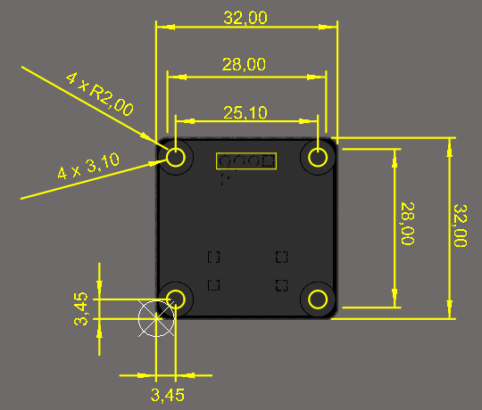
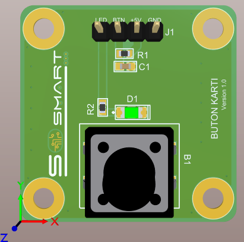
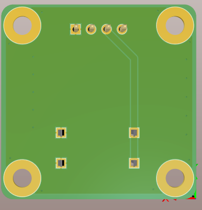
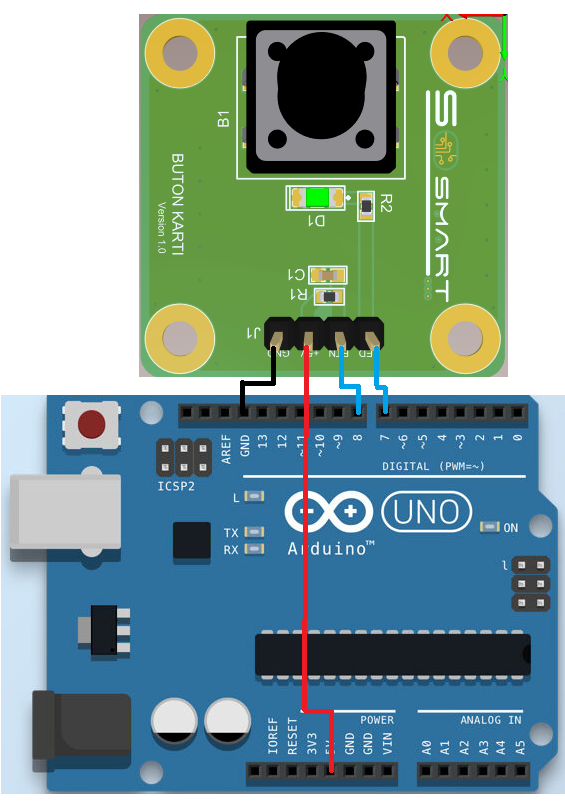
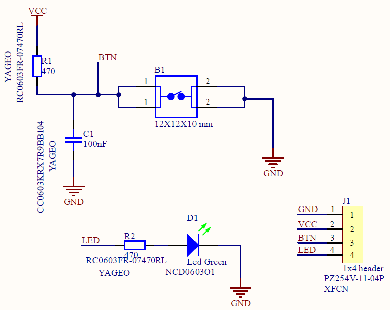

# 	 Button Kartı

### 1. KAPSAM
Bu döküman Buton Kart'ının tanımını ve çalışma prensibini açıklar.

### 2. ÜRÜN PARAMETRELERİ
- 1 Çalışma Gerilimi: DC+5V 500mA
- 2 Çalışma Sıcaklığı: 0 ~ 50 °C

### 3. MEKANİK






Pdf [PushButton-Module](Mechanic/PushButton-Module.pdf)

### 4. PİN AÇIKLAMALARI
|Pin Adı|Açıklama|
|------|------|
|LED|Kart üzerinde bulunan test amaçlı kullanılacak leddir. Örnek kullanım için 5. Arduino Bağlantısı'na bakılabilir.|
|BTN|Kulanılacak işlemci yada geliştirme kartına buton kullanımı sağlar.|
|+5V|DC +5V besleme pimi.|
|GND|Toprak bağlantı pimi.|

### 5. Arduino Bağlantısı



### 6. Devre


Sch File [PushButton-Module](Circuit/PushButton-Module.pdf) 

Bom List [BomList](Circuit/PushButton-Module-BomList.pdf) 

Gerber File [Gerber](Circuit/PushButton-Module-Gerber.zip) 

### GENEL BAKIŞ
Buton Kartı eğitim amaçlı buton kullanımı için tasarlanmıştır. Prototiplemeye imkan sağlaması, breadboard, arduino ve çeşitli devrelerde rahatça kullanılabilmesi için gerekli pinler devre kartı sayesinde dışarıya alınmıştır. Standart pin yapısı sayesinde rahatça kontrol edilebilir. Jumper kablolar ile bağlantıları yapılabilir. 

### Örnek Arduino Kodu
```

int led=7; 
int buton=8; 
 
void setup() {
pinMode(led, OUTPUT); 
pinMode(buton, INPUT); 
}
 
void loop() {
  if(digitalRead(buton)==1){ 
  digitalWrite(led, LOW); 
  }else{
  digitalWrite(led, HIGH); 
  }
 
}
```

[PushButton-Module](ArduionoExample/button/button.ino)


